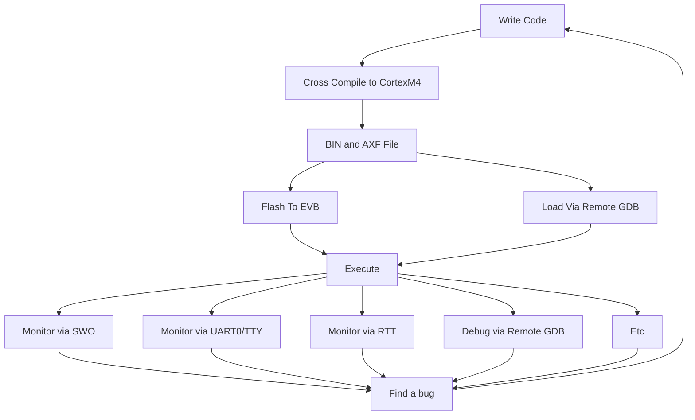
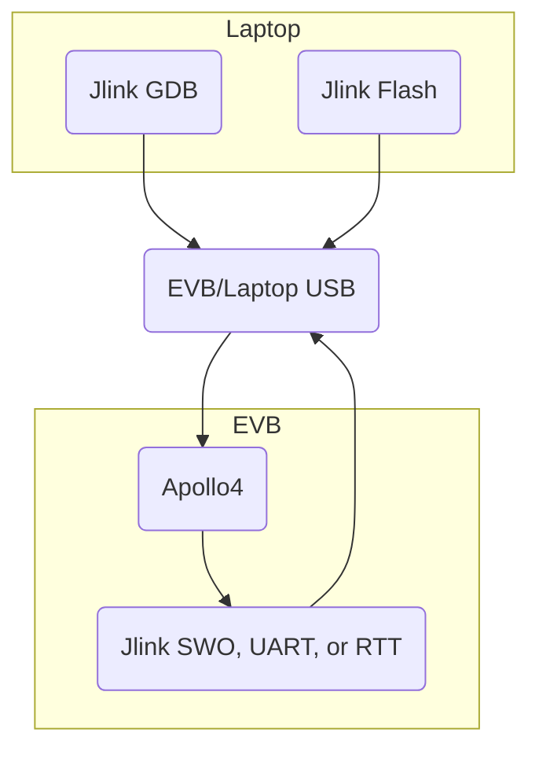

# Ambiq Development Tips and Tricks

This file is a conglomeration of tips and trips for developing Ambiq applications outside of the traditional [MCU](https://en.wikipedia.org/wiki/Microcontroller) toolchain. The first tip: if you're developing on a PC, stick to the mainstream [IAR](https://www.iar.com/products/architectures/arm/iar-embedded-workbench-for-arm/) or [Keil](https://www.keil.com/) toolchains and IDEs. If you're on Mac or Linux, read on.

## Introduction to Ambiq Development

Ambiq SOCs are microcontroller-based (in Apollo4's case specifically, they're [ARM CortexM4-based](https://developer.arm.com/Processors/Cortex-M4)). These MCUs don't have full OSes such as Linux - there are no network stacks, filesystems, threading, POSIX anything - shucks, there isn't even a proper malloc() to speak of. There *is*, however, a very nice AmbiqSuite SDK with a collection of examples to help you start building your applications.

### TL;DR Hello World

1. Install Arm GCC tools, j-link tools, and AmbiqSuite SDK
2. `cd AmbiqSuite-<version>/boards/apollo4b_evb/examples/peripherals/hello_world/gcc`
3. execute `make`
4. Deploy to EVB via jLink tool of choice

Each of these steps (except 2) is pretty involved, and you'll probably have to iterate your configuration to get it to work all the way through. See below for the details.

### Development Flow

The key thing to understand is that there is no shell, display, drive, etc, on your EVB - you flash some code onto it via the Jlink port (more on that below), interact via the Jlink remote GDB or a serial interface, and that is pretty much it.




#### Dataflow

As you can see from the following diagram, you'll develop and compile on your development platform ('laptop' in the diagram below), then use a jlink tool to send the code over USB to the EVB. Once the code is running, you can interact with with via TTY (the onboard EVB Jlink USB device will mount as a TTY USBmodem on your laptop), SWO (single wire output serial device), or RTT (real time transfer) interface. You can use any TTY app on your laptop, but the SWO and RTT interfaces are best handled by Jlink tools.



## Toolchain

Astute readers will note several tools implied by the above diagrams; specifically, you'll need the cross compiler, the Jlink tool suite. An IDE is optional, but helpful. We include instructions for VS Code below. VS Code isn't well supported for MCU development, but it works. The more standard IDEs (IAR, Kiel) only work on Microsoft's OS.

AmbiqSuite SDK

Ambiq's SDK includes everything you need to produce working binaries for the Apollo4. **It isn't publicly available** - ask your Ambiq representative for a copy.

### Cross Compiler

This is Arm's GCC [suite](https://developer.arm.com/tools-and-software/open-source-software/developer-tools/gnu-toolchain/gnu-rm/downloads). You'll need to install that on your development platform and later point your environment variables, Makefiles, and VSCode paths to where you installed them.

### Jlink

SEGGER Jlink is a tool suite for developing on evaluation boards. SEGGER has a *pile* of stuff, but what you're looking for is the J[-Link Software and Documentation Pack](https://www.segger.com/downloads/jlink/) - it includes all the tools you need.

Note: you'll see a lot of confusing discussion of Jlink probes, IDEs, etc. The Apollo EVB has a built-in Jlink node, which you connect to directly via USB, so you don't need any of that stuff, just the tools and a USB cable.

### IDE

This readme covers the use of Visual Studio Code, and the provided config files for the above toolchains. Other IDEs are left as an exercise to the user.

### Project Skeleton

In the [skeleton](skeleton) directory you can find a template to get you
started on a new project repository (ideally you're also pushing this to
github!).

Out of the box this sets you up for python/c based development, provides
automatic execution of tests and linting, and will help ensure you are
writing code in a manner consistent with other Ambiq developers.

### Other Stuff

Depending on your setup, you'll likely need other stuff (LLVM, Tensorflow, CMake, Xcode command line tools, etc) but the above are the basic tools you'll use to compile and execute your code.

## Terminology

| Term               | Definition                                                   |
| ------------------ | ------------------------------------------------------------ |
| EVB                | Evaluation board. Comes in different flavors requiring different binaries, but all have same basic functionality |
| Apollo4            | Ambiq's Cortex 4M+FPU SOC                                    |
| Apollo4b           | RevB of the Apollo4                                          |
| Apollo4p           | 'P' stands for 'Plus' - the latest version of Apollo4        |
| Apollo4[b\|p]_blue | The bluetooth version of the Apollo4b or 4p                  |
| SWO                | Single Wire Output: a low speed, easy to use debug interface. You can printf to it. |
| BSP                | Board Specification Package. Includes things like GPIO pin definitions, peripheral maps, etc. When you need to mess with GPIO or alternate UARTs, this is where they're defined. |


## Working with AmbiqSuite SDK

When you unzip the SDK, most of the object and lib files will already exist, which makes it easy to get started: just `cd` to and example directory's `gcc` subdirectory and execute `make` - this will only compile the example, linking in everything else.

Below, we expand the more interesting directories in the SDK. We only show one example, `hello_world` but there are many other useful examples.

```bash
AmbiqSuite-SDK
	mcu/						# Defines the HAL (HW abstraction layer) you'll use to configure Apollo
	boards/
		apollo4b_evb/	# Each EVB has it's own BSP and Examples directory, but only small deltas
			bsp/ 				# 'board specification package' - defines registers, peripherals, etc.
			examples/
				peripherals/
					hello_world/
						src/
							<source code for hello world>
						gcc/
							Makefile # this is the makefile you'll invoke to build for gcc
							<gcc bootstrap code and linker script>
							bin # this is where your binaries and artifacts land
								hello_world.bin
								hello_world.axf
								...
						iar/
						keil/
					...
				...
		apollo4b_blue_evb
		apollo4p_evb
		apollo4p_blue_evb
```

The examples are nearly identical for every EVB, so there is a lot of replicated code. The AI repos are designed to be installed inside an `example` directory, but the makefiles allow you to compile across boards, so you don't have to replicate the AI code to different board/example directories.

## Working with Visual Studio Code

VSCode can be configured to build, deploy, and debug code on an EVB. You'll need a couple of VS Code plugins and configuration files to get things working.

### Arm Development Extensions

You'll need the following (install from VS Code's extensions browser):

- [Cortex-Debug](https://marketplace.visualstudio.com/items?itemName=marus25.cortex-debug) (by marus25)
- [Arm Assembly](https://marketplace.visualstudio.com/items?itemName=dan-c-underwood.arm) (by dan-c-underwood)

### Configuration Files

VS Code configuration files live in a `.vscode` directory at the root of your SDK directory structure. We need to create two files: a tasks file that tells VS code how to build Ambiq binaries, and a launch file that tells it how to use Jlink to install and execute the binary on an EVB

This is the `tasks.json` file. The way it is written, you have to launch the build task while the editor is 'focused' on the `main()`.

```json
{
    // See https://go.microsoft.com/fwlink/?LinkId=733558
    // for the documentation about the tasks.json format
    "version": "2.0.0",
    "tasks": [
        {
            "type": "shell",
            "label": "Build Project",
            "command": "make",
            "options": {
                "cwd": "${fileDirname}/../gcc/."
            },
            "group": {
                "kind": "build",
                "isDefault": true
            },
            "problemMatcher": {
                "base": "$gcc",
                "fileLocation": ["relative", "${relativeFileDirname}/."]
            }
        }
    ]
}
```

The `tasks.json` file defines a 'launch' task. There are several hardcoded paths. There may be a clever way to make them soft paths, but I haven't bothered looking.

```json
{
    // Use IntelliSense to learn about possible attributes.
    // Hover to view descriptions of existing attributes.
    // For more information, visit: https://go.microsoft.com/fwlink/?linkid=830387
    "version": "0.2.0",
    "configurations": [
        {
            "cwd": "${fileDirname}",
            "executable": "../gcc/bin/${fileBasenameNoExtension}.axf",
            "name": "Debug Microcontroller",
            "request": "launch",
            "type": "cortex-debug",
            "servertype": "jlink",
            "serverpath": "<YOUR PATH>/SEGGER/JLink/JLinkGDBServer",
            "armToolchainPath": "<YOUR PATH>/gcc-arm-none-eabi-10.3-2021.07/bin",
            "device": "AMAP42KK-KBR",
            "interface": "swd",
            "serialNumber": "",
            "runToMain": tru
            "svdFile": "${workspaceRoot}/pack/SVD/apollo4b.svd", // CHANGE PER BOARD

        }
    ]
}
```

## I/O Interfaces

AmbiqSuite has robust support for "printing" to several character-based interfaces. It doesn't have the same for reading from those interfaces (see the [AI MLPerf repo](https://github.com/AmbiqAI/ai/blob/main/mlperf/src/am_utils/uart.c) for an example implementation of a blocking `getchar()`).

Printing to an interface involves enabling it, pointing the HAL `printf` to that interface, and running a laptop-side application that can display it.

| Interface  | Working with it                                              | Application                                                  |
| ---------- | ------------------------------------------------------------ | ------------------------------------------------------------ |
| SWO        | `am_bsp_debug_printf_enable()` to enable. See `examples/peripherals/hello_world/src/` for example code. | JlinkSWOViewer - set the speed to 1000.                      |
| UART0      | This is attached to the Jlink USB COM port. I've run it as fast as 115200, but don't know the real limit, it might go faster.  It is more involved than SWO to get working - see `examples/peripherals/hello_world_uart/src/` for basic example code, and the [AI MLPerf repo](https://github.com/AmbiqAI/ai/blob/main/mlperf/src/am_utils/uart.c) for input and output examples. This port will mount as a TTY device on your laptop (on a mac, look in /dev/tty* for something like 'usbmodem...'). | Any TTY terminal. The SDK does not add carriage returns to `/n`, only linefeed characters, so configure your application to emulte CRs. |
| UART1-3    | Apollo4 has 4 UARTs. '0' works as described above, and 1-3 via overloaded GPIO pins. Only use these if needed (for the EEMBC Energy Monitor, for example), and look at the [AI MLPerf repo](https://github.com/AmbiqAI/ai/blob/main/mlperf/src/am_utils/uart.c) for example code. | n/a                                                          |
| RTT        | Real Time Transfer is a fast interface offered by Jlink. Use this to transfer larger files (test images, audio) and faster rates. I'm just starting to work with this, so I can't offer much guidance, but look at `examples/audio/audadc_rtt_stream/src/` for example code using the Jlink library. | To view: JLinkRTTViewer, to stream to a file: jlinkrttlogger (GUI or command line). |
| GPIO       | Only use if needed - for example, we use this in MLPerf to tell EEMBC's application where the 'region of interest' is. See the [AI MLPerf repo](https://github.com/AmbiqAI/ai/blob/main/mlperf/src/am_utils/uart.c) for example code (look for 'timestamp'). | n/a                                                          |
| LEDs       | There are 3 user-controllable LEDs mounted under the EVB. See `examples/peripherals/binary_counter/src/` | n/a                                                          |
| Buttons    | There are 2 user-readable buttons on the EVB. I haven't used them yet, so TBI. | TBI                                                          |
| Microphone | Working on this, still haven't figured it out 100%           | TBI                                                          |


## Memory

There is no memory allocation facility.

There are 3 memory types

- MRAM: ~2MB of non-volatile, R/W. By default your code and `const` will be mapped here.
- TCM: Arm's 'tightly coupled memory' - fast SRAM that is directly addressable by the core. By default your stack and heap are mapped here. There is just shy of 400KB, so use sparingly. For example, I put MLPerfs models here, but the Person Detect model doesn't fit, so I put that in MRAM
- SRAM: 1.5MB of SRAM. Fast, but slower than TCM, and more power hungry. I haven't used this yet.
